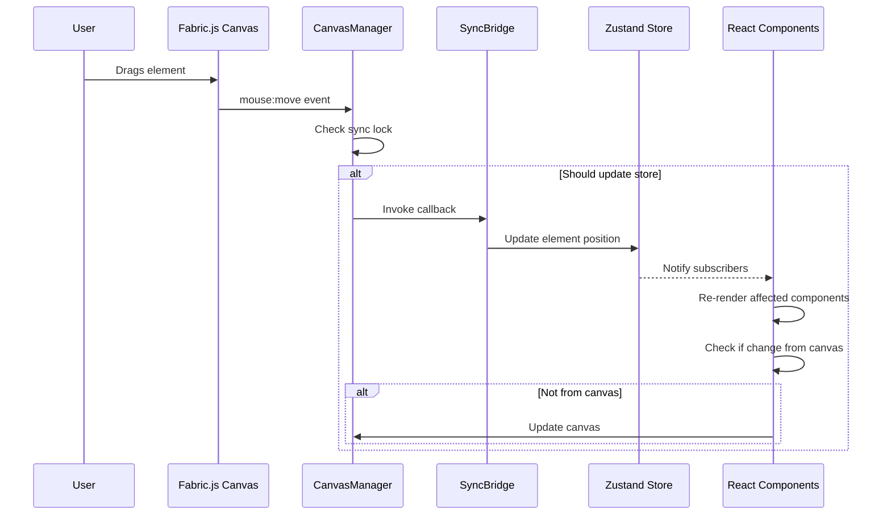

# Pinterest Editor - Architecture Documentation

> **Status:** Living Document  
> **Last Updated:** 2025-12-15  
> **Version:** 0.1.0

---

## 📋 Table of Contents

1. [Project Overview](#project-overview)
2. [Technology Stack](#technology-stack)
3. [Directory Structure](#directory-structure)
4. [Data Flow Architecture](#data-flow-architecture)
5. [State Management](#state-management)
6. [Component Hierarchy](#component-hierarchy)
7. [Third-Party Integrations](#third-party-integrations)
8. [Key Design Decisions](#key-design-decisions)

---

## 1. Project Overview

### What Problem Does This Solve?

The Pinterest Editor is a **dynamic template design tool** that enables users to create customizable Pinterest pin templates with data-driven content. It solves the problem of:

- Manual, repetitive pin creation for campaigns
- Lack of batch generation capabilities
- No dynamic data integration (CSV → Pins)
- Limited design flexibility for non-designers

### Who Are the Users?

- **Primary:** Marketing teams, social media managers, content creators
- **Secondary:** Small businesses, e-commerce sellers
- **Technical Level:** Non-technical users (no design/coding skills required)

### Core Features

1. **Visual Canvas Editor**

   - Drag-and-drop element placement (text, images, shapes)
   - Real-time preview with Fabric.js rendering
   - Canva-style handles and controls
   - Multi-element selection and manipulation

2. **Dynamic Data Integration**

   - CSV import for batch personalization
   - Field mapping ({{productName}}, {{price}}, etc.)
   - Preview mode with live data substitution
   - Bulk export (generate 100s of pins)

3. **Template Management**

   - Save/load templates
   - Template gallery with thumbnails
   - Import from Canva (SVG support)
   - Cloud storage (S3 + Supabase)

4. **Professional UI/UX**

   - Properties panel (position, appearance, effects)
   - Layers panel (reorder, visibility, lock)
   - Responsive design (desktop + mobile)
   - Undo/redo with history management

5. **Export Capabilities**
   - PNG export (1x, 2x, 3x resolution)
   - Bulk generation (CSV data → multiple pins)
   - ZIP download for batch exports

### Technical Constraints

- **Client-Side Only:** All rendering happens in browser (no server-side rendering for editor)
- **Browser Support:** Modern browsers with Canvas API support (Chrome, Firefox, Safari, Edge)
- **Performance Target:** 60 FPS with 500+ elements on canvas
- **Data Limits:** Max 1,000 rows per CSV import (memory constraints)
- **File Size:** Max 10MB per uploaded image

---

## 2. Technology Stack

### Core Framework

**Next.js 16.0.8** (App Router)

- **Why this version?**
  - Latest stable release
  - React 19 support
  - Improved performance with React Compiler
  - App Router for better code organization
- **Trade-offs:** Bleeding edge (some libraries may lag in compatibility)

**React 19.2.1**

- **New features used:**
  - React Compiler (automatic memoization)
  - `use` hook for async components
  - Server Actions (for future server features)
- **Why upgrade?** Performance improvements, better developer experience

**TypeScript 5**

- **Strictness level:** Partial strict mode (not full strict yet)
- **Current config:**
  - `strict: false` (to be enabled in Phase 7)
  - Many `any` types (technical debt)
  - No branded types yet
- **Goal:** Enable full strict mode during refactoring

### Canvas & Rendering

**Fabric.js 6.9.0**

- **Why not Konva?**
  - Fabric has better text rendering
  - More mature ecosystem
  - Built-in features (alignment guides, custom controls)
  - Better documentation
- **Migration:** Previously used Konva, migrated to Fabric (~20 hours effort)
- **Usage:** All canvas element rendering, manipulation, event handling

### State Management

**Zustand 5.0.9**

- **Why not Redux?**
  - Simpler API (no boilerplate)
  - Better TypeScript support
  - Smaller bundle size
  - No Provider wrapping needed
- **Why not Context?**
  - Performance (Context causes re-renders)
  - Better DevTools integration
  - Easier testing
- **Architecture:** Single consolidated store (as of 2025-12-21)
  - `editorStore` - **Primary store** (elements, selection, canvas, history, templates)
  - `alignmentStore` - Element alignment utilities (pure functions)
  - `templateStore` - Template gallery operations
  - `categoryStore` / `tagStore` - Template organization
  - `snappingSettingsStore` - Canvas snapping configuration
  - `toastStore` - Toast notification queue
  - `generationStore` - Bulk generation state
  - `templateMetadataStore` - Template categories/tags assignment
- **Note:** Previously had separate `elementsStore`, `selectionStore`, `canvasStore`, `layersStore` (consolidated into `editorStore`)

### Styling

**Tailwind CSS v4**

- **Custom configuration:**
  - Extended color palette (blue, purple, gray shades)
  - Custom animations (`fadeIn`, `slide-in-right`, `shake`, `shimmer`)
  - Custom spacing scale
  - Font family: Inter (from Google Fonts)
- **Why v4?**
  - Performance (CSS-first architecture)
  - Better PostCSS integration
  - Cleaner API

### Additional Libraries

| Library             | Version | Purpose                        | Bundle Impact          |
| ------------------- | ------- | ------------------------------ | ---------------------- |
| `@hello-pangea/dnd` | 18.0.1  | Drag-and-drop (layers panel)   | ~40KB                  |
| `sonner`            | 2.0.7   | Toast notifications            | ~8KB                   |
| `date-fns`          | 4.1.0   | Date formatting                | ~20KB (tree-shakeable) |
| `papaparse`         | 5.5.3   | CSV parsing                    | ~45KB                  |
| `jszip`             | 3.10.1  | ZIP generation (bulk export)   | ~75KB                  |
| `lodash`            | 4.17.21 | Utilities (debounce, throttle) | **~70KB** ⚠️           |
| `use-image`         | 1.1.4   | Image loading hook             | ~3KB                   |
| `react-colorful`    | 5.6.1   | Color picker                   | ~15KB                  |
| `nanoid`            | 5.1.6   | ID generation                  | ~2KB                   |
| `clsx`              | 2.1.1   | Class name utility             | ~1KB                   |
| `tailwind-merge`    | 3.4.0   | Merge Tailwind classes         | ~8KB                   |

**⚠️ Dependencies to Optimize:**

- **lodash:** Should use `lodash-es` or native JS (save ~60KB)
- **use-image:** Could implement ourselves (~50 lines)
- **jszip:** Lazy load only when exporting (save initial bundle)
- **papaparse:** Lazy load only when importing CSV

---

## 3. Directory Structure

```
src/
├── app/                        # Next.js App Router
│   ├── Purpose: Routing, layouts, page components
│   ├── dashboard/             # Template dashboard page
│   ├── editor/                # Main editor page
│   │   └── page.tsx          # Editor layout orchestrator
│   ├── login/                 # Authentication pages
│   ├── api/                   # API routes
│   │   └── proxy-image/      # CORS proxy for images
│   ├── layout.tsx            # Root layout (fonts, analytics)
│   └── globals.css           # Global styles + Tailwind

├── components/                 # React Components
│   ├── campaign/              # Campaign generation UI
│   │   ├── Purpose: Bulk pin generation interface
│   │   ├── GenerationController.tsx  # Main generation orchestrator
│   │   ├── CSVUpload.tsx            # CSV file upload
│   │   ├── FieldMapper.tsx          # Map CSV columns to template fields
│   │   └── GenerationProgress.tsx   # Progress tracking
│   │
│   ├── canvas/                # Canvas-related components
│   │   ├── Purpose: Canvas rendering & interaction
│   │   ├── EditorCanvas.tsx         # Main Fabric.js canvas wrapper
│   │   ├── ElementToolbar.tsx       # Floating toolbar (rotate, lock, delete)
│   │   ├── DimensionBadge.tsx       # Shows dimensions during resize
│   │   └── CanvasArea.tsx           # Canvas container + rulers
│   │
│   ├── dashboard/             # Dashboard components
│   │   ├── Purpose: Template management dashboard
│   │   ├── TemplateCard.tsx         # Template preview card
│   │   └── TemplateGrid.tsx         # Grid of templates
│   │
│   ├── editor/                # Editor-specific components
│   │   ├── Purpose: Editor utilities
│   │   ├── EmptyCanvasState.tsx     # Shown when no elements
│   │   └── DesktopOnlyMessage.tsx   # Mobile warning
│   │
│   ├── gallery/               # Template gallery
│   │   ├── Purpose: Browse pre-made templates
│   │   └── TemplateGallery.tsx      # Modal with template selection
│   │
│   ├── import/                # Import functionality
│   │   ├── Purpose: Import from external sources
│   │   └── CanvaImportModal.tsx     # Import Canva SVG files
│   │
│   ├── layout/                # Layout containers
│   │   ├── Purpose: App structure (header, sidebars)
│   │   ├── Header.tsx              # Top bar (logo, save, user menu)
│   │   ├── LeftSidebar.tsx         # Tools + templates (256px, responsive)
│   │   ├── RightPanel.tsx          # Properties + Layers (384px, responsive)
│   │   └── Toolbar.tsx             # Element actions (add text, undo, etc.)
│   │
│   ├── panels/                # Side panels
│   │   ├── Purpose: Property editing + layer management
│   │   ├── PropertiesPanel.tsx     # Edit element properties (800+ lines) ⚠️
│   │   └── LayersPanel.tsx         # Drag-to-reorder layer list
│   │
│   └── ui/                    # Reusable UI primitives
│       ├── Purpose: Design system components
│       └── ToastContainer.tsx       # Toast notification display

├── hooks/                      # Custom React Hooks
│   ├── Purpose: Reusable stateful logic
│   ├── useToast.ts                 # Easy toast triggering
│   ├── useStageRef.ts              # Access canvas ref globally
│   └── useSynchronizationBridge.ts # Sync Fabric ↔ Zustand

├── lib/                        # Core Libraries
│   ├── Purpose: Business logic, utilities, integrations
│   │
│   ├── canvas/                # Canvas management
│   │   ├── CanvasManager.ts        # Fabric.js wrapper (500+ lines) ⚠️
│   │   ├── SpatialHashGrid.ts      # Collision detection
│   │   └── elementChangeDetection.ts # Detect what changed
│   │
│   ├── fabric/                # Fabric.js utilities
│   │   ├── engine.ts               # Isomorphic rendering engine
│   │   ├── AlignmentGuides.ts      # Magnetic guides
│   │   └── FabricControlConfig.ts  # Custom Canva-style handles
│   │
│   ├── db/                    # Database operations
│   │   ├── templates.ts            # CRUD for templates
│   │   ├── campaigns.ts            # CRUD for campaigns
│   │   └── index.ts                # Shared DB utilities
│   │
│   ├── utils/                 # Utility functions
│   │   ├── csvParser.ts            # Parse CSV files
│   │   ├── csvValidator.ts         # Validate CSV structure
│   │   ├── fieldNameParser.ts      # Parse {{fieldName}} syntax
│   │   └── debug.ts                # Debug logging
│   │
│   ├── config/                # Configuration
│   │   └── features.ts             # Feature flags
│   │
│   ├── canvasUtils.ts         # Canvas utilities (export, thumbnail)
│   ├── s3.ts                  # AWS S3 client
│   ├── supabase.ts            # Supabase client
│   ├── fonts.ts               # Google Fonts loader
│   ├── constants.ts           # App constants
│   ├── utils.ts               # General utilities
│   └── validations.ts         # Input validation

├── stores/                     # Zustand Stores
│   ├── Purpose: Global state management
│   ├── editorStore.ts              # Consolidated editor state (elements, selection, canvas, history)
│   ├── alignmentStore.ts           # Element alignment utilities
│   ├── templateStore.ts            # Template gallery operations
│   ├── categoryStore.ts            # Category CRUD
│   ├── tagStore.ts                 # Tag CRUD with autocomplete
│   ├── templateMetadataStore.ts    # Template metadata assignment
│   ├── snappingSettingsStore.ts    # Snapping configuration
│   ├── toastStore.ts               # Toast queue
│   └── generationStore.ts          # Generation progress

└── types/                      # TypeScript Types
    ├── Purpose: Shared type definitions
    ├── canvas.ts                   # Canvas-related types
    ├── template.ts                 # Template types
    └── index.ts                    # Re-exports

```

### ⚠️ God Files (>500 lines)

These files need attention:

| File                  | Lines | Status                    | Action Required                   |
| --------------------- | ----- | ------------------------- | --------------------------------- |
| `PropertiesPanel.tsx` | ~800  | 🔴 Critical               | Split into sub-panels             |
| `CanvasManager.ts`    | ~500  | 🔴 Critical               | Extract services                  |
| `editorStore.ts`      | ~1100 | 🟡 Large but consolidated | Consider slicing by domain        |
| `LeftSidebar.tsx`     | ~500  | 🟡 Moderate               | Already cleaned (responsive work) |
| `EditorCanvas.tsx`    | ~450  | 🟡 Moderate               | Extract event handlers            |

---

## 4. Data Flow Architecture

### User Interaction Flow



### Key Principles

1. **Single Source of Truth:** Zustand store is authoritative
2. **Bidirectional Sync:** Canvas ↔ Store kept in sync
3. **Circular Prevention:** Synchronization lock prevents infinite loops
4. **Selective Updates:** Only affected components re-render

### Element Lifecycle Flow

```
┌─────────────────────────────────────────────────────────────┐
│ 1. User Action: Click "Add Text" in Toolbar                │
└─────────────────────────────────────────────────────────────┘
                          ↓
┌─────────────────────────────────────────────────────────────┐
│ 2. Action Dispatched: editorStore.addText()                │
│    - Generates unique ID (nanoid)                           │
│    - Creates element data object                            │
│    - Validates data (type, dimensions)                      │
└─────────────────────────────────────────────────────────────┘
                          ↓
┌─────────────────────────────────────────────────────────────┐
│ 3. Store Update: element added to store.elements[] array   │
│    - State immutably updated                                │
│    - Subscribers notified                                   │
└─────────────────────────────────────────────────────────────┘
                          ↓
┌─────────────────────────────────────────────────────────────┐
│ 4. React Re-render: EditorCanvas useEffect triggers        │
│    - Detects new element in elements array                 │
│    - Calls CanvasManager.addElement(newElement)             │
└─────────────────────────────────────────────────────────────┘
                          ↓
┌─────────────────────────────────────────────────────────────┐
│ 5. Canvas Manager: Creates Fabric.js object                │
│    - new fabric.Textbox(...) for text elements             │
│    - Applies properties (position, color, font)             │
│    - Stores in elementMap (id → fabricObject)               │
└─────────────────────────────────────────────────────────────┘
                          ↓
┌─────────────────────────────────────────────────────────────┐
│ 6. Spatial Grid: Register element for collision detection  │
│    - Calculates bounding box                                │
│    - Inserts into hash grid cells                           │
└─────────────────────────────────────────────────────────────┘
                          ↓
┌─────────────────────────────────────────────────────────────┐
│ 7. Custom Controls: Apply Canva-style handles              │
│    - Corner controls (resize)                               │
│    - Middle controls (resize from edges)                    │
│    - Rotation control                                       │
└─────────────────────────────────────────────────────────────┘
                          ↓
┌─────────────────────────────────────────────────────────────┐
│ 8. Canvas Render: Element appears on screen                │
│    - Fabric.js renders to <canvas> element                  │
│    - Element is selectable and draggable                    │
└─────────────────────────────────────────────────────────────┘
                          ↓
┌─────────────────────────────────────────────────────────────┐
│ 9. UI Updates: Properties panel + Layers panel update      │
│    - Properties panel shows element properties              │
│    - Layers panel adds new layer item                       │
└─────────────────────────────────────────────────────────────┘
```

### Undo/Redo Flow

```
User makes change (move element)
        ↓
Before applying: history.past.push(currentState)
        ↓
Apply change to store
        ↓
Clear history.future[] (redo no longer valid)
        ↓
Limit history.past to 50 items (memory management)
        ↓
User presses Cmd+Z (undo)
        ↓
Pop last state from history.past
        ↓
Push current state to history.future
        ↓
Apply popped state to store
        ↓
Canvas updates to match restored state
```

**Current Limitations:**

- ❌ No granular undo (entire state snapshot)
- ❌ Large memory footprint (50 full states)
- ❌ No undo compression
- ✅ **Future:** Command pattern with delta storage

---

## 5. State Management

### editorStore (Main Store)

**File:** `src/stores/editorStore.ts` (800+ lines)

**State Schema:**

```typescript
{
  // Template metadata
  templateId: string
  templateName: string
  isNewTemplate: boolean

  // Canvas configuration
  canvasSize: { width: number, height: number }
  backgroundColor: string
  zoom: number

  // Elements
  elements: Element[]  // Array of all canvas elements
  selectedIds: string[] // Multi-selection support

  // Templates list
  templates: TemplateListItem[]

  // History (undo/redo)
  history: {
    past: EditorState[]   // Max 50 items
    future: EditorState[]
  }

  // UI state
  previewMode: boolean
  isSaving: boolean
  activeTab: 'properties' | 'layers'

  // Dynamic data
  csvData: { headers: string[], rows: any[] } | null
  currentDataRow: number
}
```

**Actions (36 total):**

- **Template:** `loadTemplate`, `resetToNewTemplate`, `setTemplateName`, `setTemplates`
- **Elements:** `addElement`, `updateElement`, `deleteElement`, `replaceElements`, `clearElements`
- **Selection:** `selectElement`, `selectMultiple`, `deselectAll`
- **Canvas:** `setCanvasSize`, `setBackgroundColor`, `setZoom`
- **History:** `undo`, `redo`, `pushHistory`
- **Data:** `loadCSV`, `setCurrentDataRow`, `clearCSV`
- **UI:** `setPreviewMode`, `setIsSaving`, `setActiveTab`

**⚠️ Issues:**

- Too many responsibilities (should be split into slices)
- No TypeScript strict mode
- Many `any` types
- No Zod validation

### snappingSettingsStore

**File:** `src/stores/snappingSettingsStore.ts`

**Purpose:** Configure canvas snapping behavior

**State:**

```typescript
{
  snapToGrid: boolean;
  snapToElements: boolean;
  snapToPage: boolean;
  snapThreshold: number; // pixels
  gridSize: number; // pixels
}
```

**Persistence:** localStorage (survives page reload)

### toastStore

**File:** `src/stores/toastStore.ts`

**Purpose:** Manage toast notification queue

**State:**

```typescript
{
  toasts: Array<{
    id: string;
    type: "success" | "error" | "warning" | "info";
    message: string;
    duration: number; // ms
  }>;
}
```

**Features:**

- Auto-dismiss after duration
- Max 3 visible (queue others)
- Unique IDs (nanoid)
- Slide-in animation

### generationStore

**File:** `src/stores/generationStore.ts`

**Purpose:** Track bulk pin generation progress

**State:**

```typescript
{
  isGenerating: boolean
  total: number
  current: number
  failed: string[]  // Failed pin IDs
  csvData: any[]
}
```

---

## 6. Component Hierarchy

```
App (Next.js Layout)
│
├── Header (56px height, fixed top)
│   ├── Logo (links to /dashboard)
│   ├── TemplateNameInput (editable, validated)
│   ├── ImportCanvaButton (gradient)
│   ├── PreviewToggle (switch)
│   ├── SaveButton (primary CTA)
│   └── UserMenu (email + logout)
│
├── EditorLayout (flex row, h-screen)
│   │
│   ├── LeftSidebar (256px, responsive with toggle)
│   │   ├── ElementButtons
│   │   │   ├── AddTextButton
│   │   │   ├── AddImageButton
│   │   │   ├── AddShapeButton
│   │   │   └── AddFrameButton
│   │   │
│   │   ├── QuickActions (collapsible)
│   │   │   ├── TemplateGalleryButton
│   │   │   └── KeyboardShortcutsButton
│   │   │
│   │   ├── MyTemplates (collapsible, scrollable)
│   │   │   └── TemplateCard[] (draggable, with menu)
│   │   │
│   │   └── NewTemplateButton (bottom, sticky)
│   │
│   ├── CanvasArea (flex-1, relative)
│   │   ├── Toolbar (top, 48px height)
│   │   │   ├── UndoButton
│   │   │   ├── RedoButton
│   │   │   ├── TextFormattingButtons (bold, italic, underline)
│   │   │   ├── AlignmentButtons (left, center, right)
│   │   │   └── ZoomControls (-, dropdown, +, fit)
│   │   │
│   │   ├── CanvasContainer (absolute, padded)
│   │   │   ├── EditorCanvas (Fabric.js wrapper)
│   │   │   │   ├── <canvas> element (Fabric renders here)
│   │   │   │   ├── ElementToolbar (floating above selected)
│   │   │   │   │   ├── RotateButton
│   │   │   │   │   ├── LockButton
│   │   │   │   │   ├── DuplicateButton
│   │   │   │   │   ├── DeleteButton
│   │   │   │   │   └── MoreButton
│   │   │   │   │
│   │   │   │   └── DimensionBadge (shows during resize)
│   │   │   │
│   │   │   ├── AlignmentGuides (overlay, purple lines)
│   │   │   └── EmptyCanvasState (shown when no elements)
│   │   │
│   │   └── Rulers (future: horizontal + vertical)
│   │
│   └── RightPanel (384px, responsive with toggle)
│       ├── TabBar (48px height)
│       │   ├── PropertiesTab
│       │   └── LayersTab
│       │
│       └── TabContent (scrollable)
│           │
│           ├── PropertiesPanel (when active)
│           │   ├── LayerOrderSection
│           │   │   ├── BringToFrontButton
│           │   │   ├── SendToBackButton
│           │   │   ├── BringForwardButton
│           │   │   └── SendBackwardButton
│           │   │
│           │   ├── AlignToPageSection
│           │   │   ├── AlignLeftButton
│           │   │   ├── AlignCenterButton
│           │   │   ├── AlignRightButton
│           │   │   ├── AlignTopButton
│           │   │   └── AlignBottomButton
│           │   │
│           │   ├── PositionSection
│           │   │   ├── XInput
│           │   │   └── YInput
│           │   │
│           │   ├── SizeSection
│           │   │   ├── WidthInput
│           │   │   ├── HeightInput
│           │   │   └── LockAspectRatioButton
│           │   │
│           │   ├── AppearanceSection
│           │   │   ├── OpacitySlider
│           │   │   └── RotationInput
│           │   │
│           │   ├── TextPropertiesSection (text only)
│           │   │   ├── FontFamilyDropdown
│           │   │   ├── FontSizeInput
│           │   │   ├── FontColorPicker
│           │   │   ├── TextAlignButtons
│           │   │   └── TextStyleButtons (bold, italic, underline)
│           │   │
│           │   ├── ImagePropertiesSection (images only)
│           │   │   └── ReplaceImageButton
│           │   │
│           │   └── EffectsSection
│           │       └── ShadowControls (future)
│           │
│           └── LayersPanel (when active)
│               ├── LayerList (drag-and-drop)
│               │   └── LayerItem[]
│               │       ├── ThumbnailIcon
│               │       ├── LayerName (editable)
│               │       ├── VisibilityToggle
│               │       ├── LockToggle
│               │       ├── DuplicateButton
│               │       └── DeleteButton
│               │
│               └── EmptyLayersState (when no elements)
│
└── ToastContainer (fixed bottom-right)
    └── Toast[] (max 3 visible, stacked)
```

---

## 7. Third-Party Integrations

### AWS S3 (Image Storage)

**Library:** `@aws-sdk/client-s3`, `@aws-sdk/lib-storage`

**Configuration:**

```typescript
// Environment variables required:
AWS_REGION=us-east-1
AWS_ACCESS_KEY_ID=...
AWS_SECRET_ACCESS_KEY=...
NEXT_PUBLIC_S3_BUCKET=pinterest-images
```

**Usage:**

- Upload user images (from local files)
- Upload generated thumbnails (template previews)
- Upload bulk-generated pins (ZIP exports)

**Current Limitations:**

- ❌ No image optimization (uploads raw files)
- ❌ No CDN (slow loading)
- ❌ No cleanup (old images accumulate)

### Supabase (Database)

**Library:** `@supabase/supabase-js`

**Configuration:**

```typescript
// Environment variables required:
NEXT_PUBLIC_SUPABASE_URL=https://xxx.supabase.co
NEXT_PUBLIC_SUPABASE_ANON_KEY=...
```

**Schema:**

```sql
-- templates table
id UUID PRIMARY KEY
user_id UUID REFERENCES auth.users
name TEXT
canvas_size JSONB
background_color TEXT
elements JSONB
thumbnail_url TEXT
created_at TIMESTAMP
updated_at TIMESTAMP

-- campaigns table
id UUID PRIMARY KEY
user_id UUID REFERENCES auth.users
template_id UUID REFERENCES templates
name TEXT
csv_data JSONB
pins JSONB
status TEXT
created_at TIMESTAMP
```

**Current Limitations:**

- ❌ No real-time updates
- ❌ No database migrations (manual schema changes)
- ❌ No foreign key constraints
- ❌ No indexes on queries

### Vercel Analytics

**Library:** `@vercel/analytics`

**Metrics Tracked:**

- Page views
- User sessions
- Performance (Web Vitals)
- Geography

**Not Tracked:**

- User actions (element added, etc.)
- Errors (need Sentry)
- Custom events

---

## 8. Key Design Decisions

### Why Fabric.js Over Konva?

**ADR:** `docs/decisions/001-use-fabricjs-over-konva.md` (to be created)

- **Better text rendering** (Konva had blurry text)
- **More mature library** (10+ years, active community)
- **Built-in features** (alignment guides, custom controls)
- **Better documentation** (comprehensive examples)

**Migration Effort:** 20 hours (worth it for quality)

### Why Three-Layer Architecture (React → Manager → Fabric)?

**Separation of Concerns:**

1. **React Layer:** UI components, user interactions
2. **Manager Layer:** Business logic, state coordination
3. **Fabric Layer:** Canvas rendering, low-level manipulation

**Benefits:**

- Testable in isolation
- Can swap Fabric for another library later
- React doesn't know about Fabric internals

### Why Client-Side Only (No SSR for Editor)?

**Reasons:**

- Canvas API not available on server
- Fabric.js requires DOM
- User state is session-based (not SEO-critical)

**Trade-offs:**

- ❌ Slower initial load
- ✅ Simpler architecture
- ✅ No server costs for editor

### Why No Server Components for Editor?

**Next.js 16 Feature:** Server Components

**Not Used Because:**

- Editor is highly interactive (needs client state)
- Canvas manipulation requires browser APIs
- WebSocket-style updates not needed yet

**Future:** Dashboard could use Server Components (template list,stats)

---

## Next Steps

This document should be updated as the codebase evolves. See:

- **Technical Debt:** `docs/TECHNICAL_DEBT.md` (to be created)
- **Refactoring Plan:** `docs/REFACTORING_PLAN.md` (to be created)
- **Dependencies Audit:** `docs/DEPENDENCIES.md` (to be created)

**Last reviewed:** 2025-12-15  
**Reviewers:** AI Agent (initial documentation)
